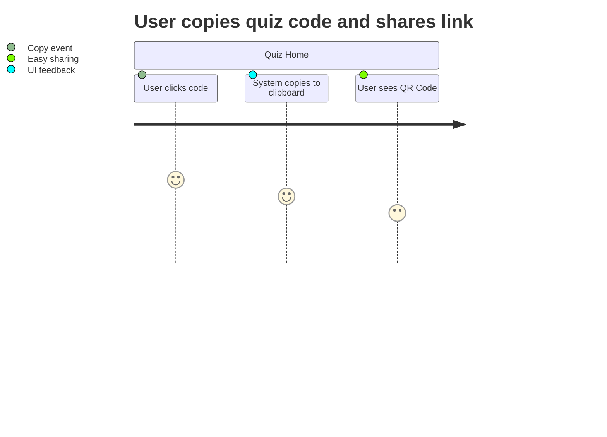
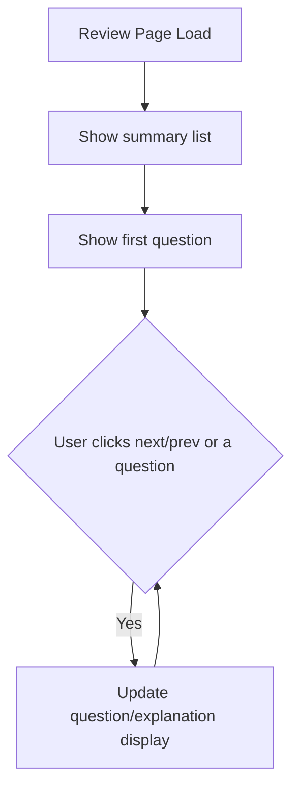
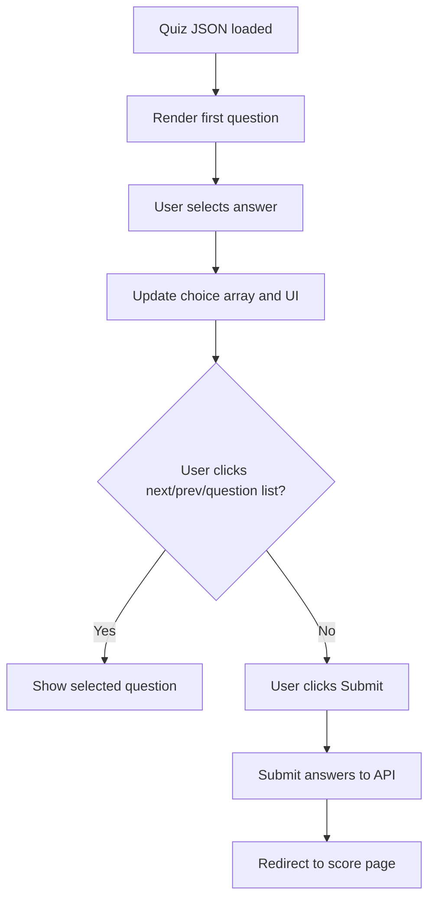
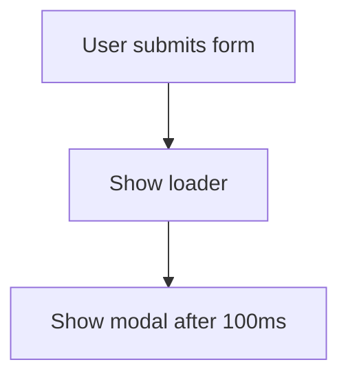

# 📚 Documentation for Quizzify PDF — Codebase

This documentation covers the structure and logic of key JavaScript files for the Quizzify PDF application. This app enables users to upload PDFs, extract content, generate quizzes, and interact with quiz features via a clear UI/UX. Below, you will find detailed explanations, flowcharts, and code usage notes for each file.

---

## 1. `pdf_to_quiz_script.js`

### Purpose

Handles PDF file drag-and-drop, extraction of text from PDFs (using [pdf.js](https://mozilla.github.io/pdf.js/)), and UI controls to select specific PDF pages for quiz generation.

---

### Main Features

| Functionality                | Description                                                                 |
|------------------------------|-----------------------------------------------------------------------------|
| Drag-and-drop PDF            | Allows user to drag PDF into a visible area for upload                      |
| PDF Selection                | Updates UI when a PDF is selected                                           |
| PDF Text Extraction          | Extracts text from the selected PDF (optionally, a page range)              |
| Page Range Handling          | User can specify which pages to extract text from                           |
| UI State Management          | Updates button states and error messages                                    |
| Form Submission Preparation  | Prepares for form submit and shows modal loader                             |

---

### Key Process Flow

```mermaid
flowchart TD
    A[User drags PDF] -->|drop| B[Read file into input#pdf]
    B --> C[Update UI: "PDF Selected"]
    C --> D[Extract pages range from user]
    D --> E[Use pdf.js to extract text from PDF]
    E --> F{Extraction Success?}
    F -- Yes --> G[Display extracted text in textarea]
    F -- No --> H[Show error message]
    G --> I[Enable submit button]
    H --> J[Disable submit button]
    I --> K[User submits form]
    K --> L[Show modal loader]
```

---

### Data Flow

- **Source:** Drag-and-drop or file input (`<input type="file" id="pdf">`)
- **Processing:** Text extraction via [pdf.js](https://mozilla.github.io/pdf.js/)
- **Destination:** Text area (`#text`) for the extracted content

---

### Key Functions

| Function        | Description                                                                              |
|-----------------|------------------------------------------------------------------------------------------|
| `pdfselected()` | Called when a PDF is selected. Updates UI and triggers text extraction.                  |
| `doo()`         | Sets up pdf.js worker and extracts text for selected page range.                         |
| `extractText()` | Uses pdf.js to extract text from the PDF, page by page, within the selected range.       |
| `pageindex()`   | Sets up the default page range in the UI after PDF is loaded.                            |
| `textentered()` | Prepares UI when text is entered manually instead of PDF.                                |
| `index_check()` | Validates and corrects the selected start/end page indices.                              |

---

### Notable Interactions

- **Disables/enables** the submit button and input fields based on extraction result.
- **Shows a modal loader** during form submission for user feedback.

---

## 2. `quiz_home.js`

### Purpose

Handles displaying and copying the quiz code, as well as generating a QR code for quiz access.

---

### Main Features

| Feature                  | Description                                                                |
|--------------------------|----------------------------------------------------------------------------|
| Copy Quiz Code           | Enables users to copy the quiz code to clipboard.                          |
| Show Feedback            | Changes the `tag` attribute to indicate that code was copied.              |
| QR Code Generation       | Uses the [QRCode.js](https://davidshimjs.github.io/qrcodejs/) library to generate a QR code for the quiz link.|

---

### Example QR Code Generation

```javascript
var qrcode = new QRCode("qrcode", {
  text: url,
  width: 256,
  height: 256,
  colorLight : "#ffffff",
  colorDark : "#5868bf",
  correctLevel: QRCode.CorrectLevel.H,
});
```

- The `url` encodes the quiz ID and starts at question 1.

---

### User Journey



---

## 3. `review.js`

### Purpose

Allows users to review their answers after completing a quiz, showing correct, incorrect, and unanswered questions, and offering navigation.

---

### Main Features

| Feature                    | Description                                             |
|----------------------------|---------------------------------------------------------|
| Review List UI             | Visualizes each question as correct, incorrect, or unanswered |
| Navigation                 | Next/Previous buttons, clickable question list          |
| Answer & Explanation Show  | Displays user's answer, correct answer, and explanation |

---

### Key Data Structures

- `getQues` — Array of questions
- `getUserAns` — User's selected answers (`4` is used for unanswered)
- `getAns` — Correct answers
- `getExpl` — Explanations for each question

---

### Review Navigation Flow



---

### Visual Feedback

Each question in the list is colored or marked based on:

- **Correct**: User's answer matches the correct answer
- **Wrong**: User's answer does not match
- **Unanswered**: User did not answer

---

## 4. `index_script.js`

### Purpose

Creates a typing animation effect for the page heading.

---

### Feature Table

| Functionality     | Description                                                             |
|-------------------|-------------------------------------------------------------------------|
| Typing Animation  | Animates the page title by gradually revealing each character           |

---

### Animation Logic

- Temporarily hides the heading
- After 1 second, reveals one character every 100ms

---

## 5. `quiz_platform.js`

### Purpose

Controls quiz-taking logic: question navigation, user answer tracking, progress UI, and submission to backend API.

---

### Main Features

| Feature             | Description                                                          |
|---------------------|---------------------------------------------------------------------|
| Modal Control       | Opens/closes quiz info modal                                        |
| Question Navigation | Next/previous question, clickable question list                     |
| Answer Tracking     | Tracks user's answers in `choice` array                             |
| UI Status           | Updates question list item data attributes (answered/unanswered)     |
| Form Submission     | Submits quiz answers to backend API and redirects to score page      |

---

### Data Flow Diagram



---

### API Integration

#### Endpoint: Submit Quiz Answers

```api
{
    "title": "Submit Quiz Answers",
    "description": "Submits user's answers for the quiz and returns a result ID.",
    "method": "POST",
    "baseUrl": "https://quizzifypdf.onrender.com",
    "endpoint": "/ques?id={quizId}",
    "headers": [
        {
            "key": "Content-Type",
            "value": "application/json",
            "required": true
        }
    ],
    "queryParams": [
        {
            "key": "id",
            "value": "Quiz ID",
            "required": true
        }
    ],
    "bodyType": "json",
    "requestBody": "{\n  \"<field1>\": \"value1\",\n  ...\n  \"arrayData\": [0,1,2,3,4]\n}",
    "responses": {
        "200": {
            "description": "Success",
            "body": "{\n  \"resultId\": \"abc123\"\n}"
        },
        "400": {
            "description": "Bad Request",
            "body": "{\n  \"error\": \"Invalid data\"\n}"
        }
    }
}
```

---

### Notable Logic

- Tracks selected answers per question using a `choice` array.
- Updates the UI to show which questions are answered.
- Submits data via `fetch`; on success, **redirects to score page**.

---

## 6. `result.js`

### Purpose

Displays the user's result after completing a quiz, updating the score visuals and feedback message.

---

### Main Features

| Feature           | Description                                                        |
|-------------------|--------------------------------------------------------------------|
| Score Visualization | Updates a CSS variable for a circular progress bar animation     |
| Result Feedback     | Shows a message and styles score according to performance        |

---

### Score Feedback Logic

| Score Condition        | Message                                | CSS Class      |
|----------------------- |----------------------------------------|----------------|
| `score >= 8`          | "You performed excellent!"              | `good`         |
| `4 <= score < 8`      | "You passed the test!"                  | `average`      |
| `score < 4`           | "You failed the test!"                  | `bad`          |

---

## 7. `form_script.js`

### Purpose

Manages the form for uploading PDFs and creating a quiz, including drag-and-drop, page range, difficulty, and UI state.

---

### Key Features

| Functionality             | Description                                                       |
|---------------------------|-------------------------------------------------------------------|
| Drag-and-drop/Select PDF  | User can drag PDF or use a button to select one                   |
| Page Range Controls       | User can specify start/end page for text extraction               |
| Difficulty Selection      | User can select quiz difficulty (updates UI accordingly)          |
| Text Extraction           | Uses pdf.js to extract the specified text range                   |
| State Management          | Enables/disables inputs and buttons based on user actions         |
| Loader Modal              | Shows a loader modal during submission                            |

---

### Process Flow

```mermaid
flowchart TD
    A[User drags/selects PDF] --> B[Text Extraction (pdf.js)]
    B --> C[Update UI: show file name, set page range]
    C --> D[User sets difficulty, page range]
    D --> E[User submits form]
    E --> F[Show modal loader]
```

---

## 8. `script.js`

### Purpose

Handles navigation highlighting and scroll-triggered animations on the main site.

---

### Main Features

| Feature               | Description                                                             |
|-----------------------|-------------------------------------------------------------------------|
| Navigation Highlight  | Switches `active` class between nav items as user scrolls to sections   |
| AOS Animation         | Triggers animation (`show` class) as elements enter/exit viewport       |

---

### Navigation Observer

- Uses `IntersectionObserver` to switch the "active" class between navigation items depending on scroll position.

---

### Animation Observer

- Observes elements with `.aos` class and toggles the "show" class for animation as they enter/leave the viewport.

---

## 9. `prompt_to_quiz_script.js`

### Purpose

Handles basic form submission logic for generating a quiz from a text prompt, showing a loader modal during processing.

---

### Main Features

| Feature         | Description                                                      |
|-----------------|------------------------------------------------------------------|
| Loader Modal    | Activates loader and shows modal after form submission           |

---

### Submission Flow



---

# Summary Table

| File                       | Purpose                                                        |
|----------------------------|----------------------------------------------------------------|
| pdf_to_quiz_script.js      | PDF upload, extraction, and page range logic for quiz creation |
| quiz_home.js               | Quiz sharing (copy code, QR code)                              |
| review.js                  | Quiz review after completion                                   |
| index_script.js            | Typing animation for heading                                   |
| quiz_platform.js           | Main quiz-taking logic, API submission                         |
| result.js                  | Post-quiz feedback and score visualization                     |
| form_script.js             | PDF upload, page range, difficulty for quiz creation           |
| script.js                  | Navigation and animation observer                              |
| prompt_to_quiz_script.js   | Show loader during prompt-to-quiz process                      |

---

# 🎉 **Conclusion**

This codebase provides a seamless UI for converting PDFs to quizzes, sharing/quizzing, and reviewing results. It leverages PDF.js for content extraction, supports interactive UI feedback, and integrates with backend APIs for quiz submission and result tracking. The modularity of the scripts supports easy expansion and maintenance.

For further technical details or backend API expansion, refer to the individual function explanations or flow diagrams above.